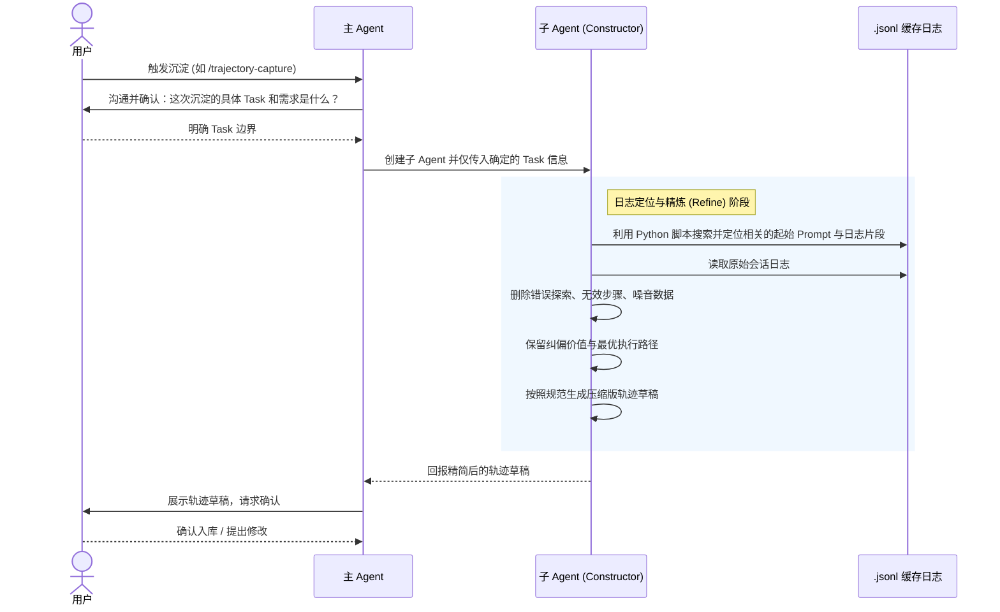
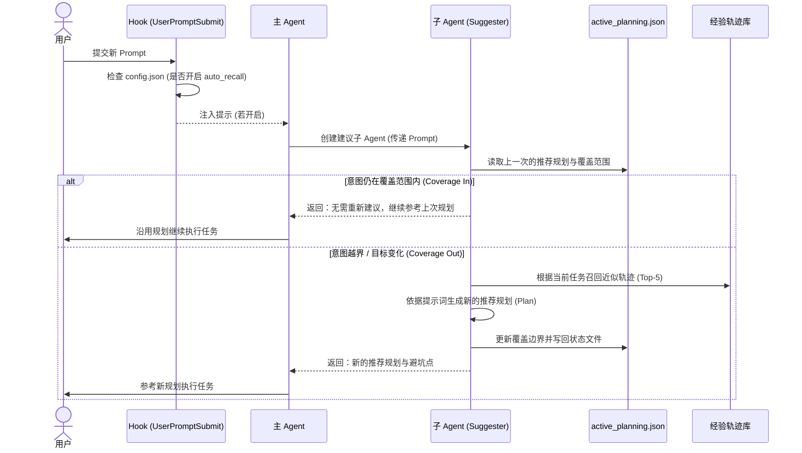

# RAG 轨迹经验增强系统（Claude Code Plugin）- 项目说明书

> 文档定位：本说明书采用“三级目录 + 设计导向”结构编写，作为项目背景说明、架构设计总览、模块边界说明和后续技术验收文档的母版。
> 适用对象：产品经理、技术负责人、研发、测试、交付团队。

## 1. 项目背景与建设目标

### 1.1 项目背景

Claude Code 在处理研发任务时，很多时候并不是“一问一答”就能结束，而是要靠多轮对话逐步澄清目标、补齐约束、修正偏航，最后才落到一条可执行的正确路径。对这类任务而言，更有复用价值的往往不是某一句回答，而是“用户如何把主 Agent 从不确定逐步带到正确轨道”的过程性经验。

从实际使用来看，常见交互模式主要有两类：

1. 简单问题递进模式：从一个小问题入手，逐步扩展到更完整的目标。
   - 例子：先问“如何在项目里开启某个 lint 规则”，再问“如何修复新增的报错”，最后演变为“如何统一重构某个模块的代码风格”。
2. 复杂任务纠偏模式：一开始就是大而复杂的任务，过程中不可避免会出现偏航与试错，需要用户持续纠正与约束。
   - 例子：一上来让 Agent “把一个现有项目改造成两-agent 插件架构”，然后在多轮中不断纠正：入口触发应使用 `UserPromptSubmit` 而不是 `PreToolUse`、运行时只允许一个 suggester、capture 必须是手动且要先确认范围等。

当前痛点不仅是“经验沉没导致重复试错”，还包括“工具与能力面变大导致选择试错”：

- 经验沉没：纠偏后的正确路径（包括关键的判断顺序、必要的输入、有效的工具调用组合）留在会话日志里。下一次遇到相似任务时，仍需要重新讲背景、重新探索、重新走一遍弯路。
- 选择困难：随着 Skills 与可用工具越来越多，主 Agent 在“选哪个 skill / 选哪个工具 / 选哪个近似能力”上更容易踩坑。
  - 典型表现：在多个近似 skill 之间来回尝试、选错工具导致返工、参数/输入不对导致无效调用，最终通过多轮试错才逼近正确解法。

本项目要做的是为 Claude Code 增加一层“轨迹经验增强能力”（也可以理解为面向主 Agent 的轨迹记忆协作层）：把历史上已经被验证有效的解决路径沉淀为可检索的“轨迹”，并在后续相似任务出现时，以“建议规划（planning suggestion）”的形式提前提供给主 Agent 参考。
该能力的目标是降低两类成本：

1. 降低重复沟通与重复试错成本：让相似任务优先复用已验证的规划边界与关键步骤。
2. 降低工具与技能选择成本：在建议中明确推荐的技能/工具路径与避坑点，减少在近似选项之间的盲试。

### 1.2 产品工作流

很多研发任务在 Claude Code 里并不会一次就做对。它更像两个人一起结对：你提出目标，Agent 给出方案；走着走着发现不对劲，你再补充约束、指出偏差、让它换工具、改路径。几轮下来，任务终于完成了。真正昂贵的不是最后那一下“改对了”，而是这一路上的试错、纠偏与选择——尤其当项目里的 skills 和工具越来越多时，走弯路会变得更频繁、更难察觉。

**经验沉淀**：这套系统想做的事情很朴素：当一次任务被你“纠偏到正确轨道”并最终跑通后，它把这条路径整理成一份可以复用的经验；下一次你遇到相似问题时。因此它需要首先主动的判断出这次多轮对话用户具体在做啥，任务需求是什么。根据这个用户需求去上下文定位到这个任务需要最开始的用户prompt，从而确定了这个task总的多轮交互轨迹，有了这些轨迹，主agent出于上下文的考虑，不会自己去总结经验， 而是创建一个子agent专门去做经验的沉淀。通常而言，主agent和子agent如何去传递这个复杂的上下文交互轨迹是一个巨大的麻烦。获取到原始轨迹的子agent会主动的按照一种模式去对轨迹进行refine。将轨迹中可能存在的错误的探索，无效的步骤等删除，需要设计一套agent规范让agent保留完成任务所需的最优轨迹。最终需要把沉淀之后的轨迹精简的回报给主agent，让他和用户确认。



**经验复用**：在 Claude Code 的真实使用里，复用最常发生在两类场景：一类是同一任务的连续追问——你把一个复杂任务拆成很多小问题逐步推进，上一轮的推荐规划往往已经覆盖了后续几轮的追问；另一类是相似任务的再次出现——隔一段时间又遇到近似改造/排查/脚本组织问题，如果没有经验复用，主 Agent 往往会重新经历一遍“选 skill、选工具、试参数、走弯路再纠偏”的过程，尤其当项目里的 skills 和工具越来越多时，这种选择试错会成为主要成本。本系统在复用阶段的核心做法是：无论手动触发（ /trajectory-suggest ）还是自动触发（ UserPromptSubmit hook 读取 config.json 开关后仅注入提示）。主 Agent 都会优先创建一个短命的建议子 agent（ trajectory-memory-suggester ）来完成“是否需要重新建议”的判断。这个判断需要专门的提示词作为判断标准让大模型去判断，重点不是“问题文字是否相似”，而是“用户当前意图是否仍在上一次推荐规划的覆盖范围内”：如果只是沿着同一个任务继续追问细节（例如追问某一步怎么执行、某个参数怎么填、某个文件放哪里），就不需要重新建议，直接提示主agent无更多意见。只有当用户目标发生了明显变化或提出了新的越界需求（例如从“完成某个改造任务”转到“新增另一条链路/解决另一类问题”，或关键约束发生变化导致原规划不再适用），才需要重新召回相似轨迹并生成新的推荐规划。

在做规划的时候，需要根据主agent之前传递过来的问题，通过召回方案去召回到近似的轨迹，然后需要设计一套提示词，让子agent去生成相关的推荐规划。



### 1.3 关键挑战

上面的小节已经把“经验沉淀”和“经验复用”的工作流说清楚了。真正落地时，难点不在于把某个脚本跑通，而在于让这套闭环在真实对话里长期稳定工作：既能从多轮纠偏中提炼出高质量轨迹，又能在后续连续追问或相似任务中给出可执行的推荐规划，并且不会把主流程拖慢。

#### 1）沉淀前的“上下文对齐”必须靠讨论完成，否则沉淀对象就是错的

真实对话里经常出现两种情况：

- 用户先从一个小问题开始问，越问越大，最后变成一个完整改造任务。
- 用户一开始就扔一个复杂任务，过程中 Agent 会偏航，用户不断纠偏才走到正确路径。

所以 `/trajectory-capture` 不能一上来就“总结整段对话”，而是要先把要沉淀的 task 讲清楚：

- 这次沉淀的任务到底是什么？
- 任务的关键约束是什么（环境、目录、工具限制、不可做项）？
- 哪些轮次属于这个任务，哪些是旁支小问题？

如果不先讨论清楚，上来就沉淀，最后很容易出现：轨迹看起来很长，但复用时完全对不上“我到底要解决什么”。

#### 2）确认 task 之后，如何“找到对应记录并交接给子 agent”，这是上下文长度的核心矛盾

在确认了 task 之后，下一步不是把“整段对话”塞给子 agent，而是要解决主 agent 的上下文负担问题：沉淀通常耗时很长，主 agent 需要把工作交给子 agent 独立完成。

这里的关键挑战是交接方式：主 agent 只需要基于已确认的任务需求，将其作为输入交给 `trajectory-memory-constructor`。而 **具体的日志定位与检索工作（例如通过 Python 脚本去** **`~/.claude/projects/{project-path}/*.jsonl`** **里定位相关的起始 Prompt 与会话行号），则完全下放给子 agent 自己去完成**。

更贴合落地的做法是：

- 主 agent 仅传达确定的任务目标与边界。
- 子 agent（constructor）内部调用检索工具（如 grep/python 脚本），自动定位并读取原始记录、扩展上下文窗口。

这样主 agent 不需要把整段对话塞过去（避免重复占用上下文），也不需要自己去跑复杂的检索命令，子 agent 则拥有完整的自主定位与提取证据的能力。

#### 3）从原始对话数据里整理出“合适的轨迹”，本质是大模型 + 提示词的智能筛选，而不是纯程序过滤

原始 `.jsonl` 里一定会有：闲聊、试错、偏航分支、重复调用、错误工具调用。但轨迹又不能只留成功步骤，因为最值钱的往往是“为什么会走错、怎么纠正”。

所以 constructor 的挑战是做一件很“人脑式”的工作：

- 识别轨迹真正的起点和终点。
- 删除明显无关且无经验价值的调用。
- 保留那些虽然失败，但能体现关键纠偏点的步骤。
- 把这些整理成压缩经验，而不是聊天转录。

这件事用脚本只能做“读写/拼装/索引”，很难可靠做“哪些该保留哪些该删”。因此需要把筛选规则写进 constructor 的角色契约和提示词里，并且产物必须可 review。

#### 4）沉淀链路需要明确“草稿长什么样”，否则用户没法确认、系统也没法稳定入库

沉淀不是直接写最终轨迹，而是先出草稿。挑战在于草稿的形态必须能被用户快速评审：既看得懂、又能确认“这条轨迹值不值得存、存进去以后有没有用”。

一个可落地的草稿建议固定成这些内容块：

- 任务一句话：这条轨迹要解决什么（不要泛）。
- 前置与约束：环境/目录/不可做项/关键输入是什么。
- 有效路径（步骤）：按顺序列清楚怎么做，每步的目标是什么。
- 关键纠偏点：哪里错过、为什么错、怎么改回来（这是经验价值核心）。
- 工具/skill 调用提纯：哪些调用保留（有效/有纠偏价值），哪些删掉（纯噪音）。
- 完成证据：最后如何确认任务完成（例如文件变更、命令结果、行为变化）。
- 复用提示：未来遇到什么情况能直接照抄，什么情况会失效。

这样用户确认才有抓手：不是“看一大段摘要”，而是逐块检查这条经验是否有复用价值。

#### 5）自动触发的矛盾：用户多轮拆问很常见，但一次完整召回 + 生成推荐 plan 很慢

你们希望自动模式是“每轮都先评估一下”，但不能每轮都做重活。所以关键挑战是把机制做成稳定习惯：hook（`UserPromptSubmit`）只读 `config.json` 开关并注入 `additionalContext`，真正的省时来自 suggester 的第一步：复用判断。

这里的复用判断要写得足够直白：不是判断“文字像不像”，而是判断“用户现在问的这件事，是否仍在上一次推荐 plan 的意图范围内”。如果仍在范围内，就不召回、不重写 plan，而是返回继续参考上次 plan（并说明原因）；只有当用户明显换了目标/越界了，才召回 Top-5 轨迹并生成新 plan。

#### 6）“什么是一个好的 plan”本身就是挑战：否则推荐出来也指导不了主 agent

从工作流视角看，suggester 的输出并不是“多给点建议就好”，而是必须形成一份可被主 agent直接采用、并且能支撑后续复用判断的推荐规划。因此，“什么是一个好的 plan”本身就是关键挑战。

推荐 plan 至少要同时满足两个目标：主 agent 能照着执行（可操作），下一轮能用它做复用门控（可判断）。因此一个好的 plan 至少要具备：

- 步骤化：每一步要干什么、先后顺序是什么。
- 工具/skill 选择明确：选哪个、为什么选它、最容易选错的坑是什么。
- 输入缺口明确：缺哪些信息就先补，减少盲试。
- 关键验证点：做到哪一步算对，怎么验证。
- 覆盖范围：哪些问题属于这份 plan 还能解决（`coverage_in`），哪些属于越界必须重来（`coverage_out`）。
- 可扩展但不发散：顺手能解决哪些相邻问题（可选项，而不是把 plan 变成大而全）。

### 1.4 建设目标

本项目面向当前阶段的建设目标如下：

1. 建立“双子 Agent”模型，只保留 `trajectory-memory-suggester` 和 `trajectory-memory-constructor` 两个核心角色。
2. 建立“轨迹捕获 -> 元数据提取 -> 向量/索引构建 -> 运行时建议”的闭环。
3. 在自动模式下，让系统先判断“上次 planning 是否可复用”，只有不满足时才执行召回与新规划生成。
4. 在手动沉淀模式下，支持从 Claude Code 缓存会话中提炼出可复用的经验轨迹，而不是保存原始对话转录。
5. 形成一套文档、Skill、Agent、脚本、状态文件彼此对应的可交付结构。

### 1.5 非目标与范围约束

为了避免项目边界失控，当前阶段明确不做以下内容：

1. 不建设独立后端服务，项目交付形态是本地 Claude Code 插件能力包。
2. 不做自动 capture，轨迹沉淀必须由用户手动触发并确认。
3. 不做跨项目会话聚合，当前仅处理当前项目路径对应的会话日志。
4. 不做多 runtime agent 的链式协作，运行时只保留一个 suggester。
5. 不把整段轨迹正文塞进主上下文，所有的agent协作，子任务都需要保持对主agent的上下文影响最小。运行时只回传必要建议与规划摘要。

## 2. 功能的详细设计文档

### 1. 轨迹经验的沉淀（`/trajectory-capture` or `/tc`）

轨迹经验沉淀分为分为四个阶段。

第一阶段是轨迹范围确认。由于用户可能会在多轮对话过程中的任意位置手动触发 `/trajectory-capture`，而用户真正想沉淀的任务，并不一定只是当前最新一轮对话本身，因此主 agent 不能直接对“最近一次回答”做总结。更合理的做法是：主 agent 先结合当前上下文，从近到远回顾最近若干轮对话，概括出 2 至 4 个可能的任务范围或总结对象，再与用户确认这次真正要沉淀的 task。只有在 task 边界被确认之后，后续的轨迹定位与经验提炼才有意义。这个阶段的核心目标，不是立即生成轨迹，而是先把“这次到底要总结什么”说清楚。

第二阶段是对话上下文定位。在确认 task 之后，主 agent 不应把完整多轮对话全文直接传给子 agent，而应只交付轻量的定位信息，即 `session locator`。`session locator` 至少需要包含本次 task、对于这个task用户最开始的提问, 以及当前工作目录路径。随后由 `trajectory-memory-constructor` 自主去读取 `~/.claude/projects/{project-path}/*.jsonl` 中的原始会话记录，定位与该 task 相关的真实轨迹范围。这样可以减少主 agent 的上下文负担，也更符合“主 agent 只负责交接任务边界，子 agent 负责长阅读和长提炼”的设计原则。`trajectory-memory-constructor` 在拿到 `session locator` 后，需要调用脚本去找到轨迹真正的起点与终点，并保存成临时文件。

第三阶段是多轮对话轨迹总结与精炼。 得到原始轨迹之后，再对原始多轮记录进行 refine。这里的重点不是转写聊天记录，而是提炼可复用的经验路径：删除明显无关、重复、偏航且没有经验价值的内容，保留真正有效的步骤，以及那些虽然失败但能体现关键纠偏价值的操作。最终，子 agent 需要输出一份可供 review 的轨迹草稿，并按照项目约定的 Markdown 模版组织内容，使其成为“压缩后的经验轨迹”，而不是原始会话的简单摘录。

第四阶段是轨迹文件的确认、存储与派生产物构建。轨迹草稿生成后，必须先由主 agent 回传给用户确认；只有在用户明确认可后，系统才允许正式写入本地轨迹库。当前项目中，轨迹 Markdown 文件是经验沉淀的权威源，建议统一保存在 `~/.claude/learn-once/trajectories/`。在轨迹文件落盘后，再通过固定的 Python 脚本依次执行敏感信息检查、元数据提取、embedding 生成以及本地索引构建，生成 `meta.json`， `index.pkl` 等派生产物。其中，若当前环境不具备 embedding 能力，则系统需要显式退化为仅基于关键词的索引构建路径，而不能假定检索能力完全等价。

#### 1. 轨迹范围确定

这个阶段属于 `/trajectory-capture` skill 的职责范围，目标不是立刻写轨迹，而是先把“本次要沉淀的任务边界”说清楚。由于用户可能在任意一轮对话触发 capture，而真实任务既可能是“一开始就是复杂任务，后续持续纠偏”，也可能是“多个连续小问题逐步收敛成一个完整任务”，因此主 agent 不能直接把“最近一次回答”当作总结对象，而必须先做一次范围候选与确认。

建议主 agent 固定按如下顺序执行：

1. 从近到远回看最近若干轮用户提问、自己的回答、关键工具调用和用户纠偏语句。
2. 将当前上下文概括为 `2-4` 个候选 task，每个候选 task 都要包含：
   - `task_description`：一句话概括本次沉淀task对象，然后加上一段详细的描述。
   - `why_this_scope`：为什么判断这几轮属于同一个任务。
   - `anchor_user_message`：最像“这个任务正式成立”的那条用户提问。
   - `excluded_branches`：本次不纳入沉淀的旁支话题或无关小问题。
3. 向用户展示候选项，请用户选择一个，或在候选基础上补充修正。
4. 用户确认后，生成 `confirmed_task_description` 与 `anchor_user_message`, 准备交给 `trajectory-memory-constructor` 子 agent。

建议主 agent 向用户展示候选范围时采用如下结构：

```markdown
本次可以沉淀的候选 task 如下，请选择 1 个，或直接修改：

1. `<task_title_1>`
   - 为什么这样归类：`<why_this_scope_1>`
   - 任务起点候选：`<anchor_user_message_1>`
   - 不纳入本次沉淀的内容：`<excluded_branches_1>`

2. `<task_title_2>`
   - 为什么这样归类：`<why_this_scope_2>`
   - 任务起点候选：`<anchor_user_message_2>`
   - 不纳入本次沉淀的内容：`<excluded_branches_2>`
```
5. 主 agent 使用 `Agent`工具创建 subagent_type为 `trajectory-memory-constructor` 子 agent，创建成功之后发送下面的指令。
```text
请你根据下面的 session_locator 信息，先在claude code的上下文对话缓存文件中定位到task相关的轨迹的起点与终点。然后根据 轨迹精炼sop去沉淀轨迹经验，然后将轨迹保存。完成之后请你以Json格式返回轨迹的概要版本。
----
{
  "session_locator": {
    "task": "<confirmed_task_description>",
    "anchor_user_message": "<anchor_user_message>",
    "workspace_folder": "<workspace_folder>" # 当前工作目录路径
  }
}
---
返回给主agent的格式为：
```json
{
  "task_description": "<task_description>",
  "trajectory_summary": "<trajectory_summary>"
}
```

这个阶段的产出不是轨迹正文，而是一个被用户确认过的“任务边界 + 起点锚点 + 交接定位信息”。只有这三件事稳定，后面的定位、精炼和入库才有意义。

#### 2. 上下文定位（子 agent 自主定位）

上一阶段完成后，子agent已经被创建起来了，需要根据主agent传递过来的信息，完成定位任务。通常直接调用脚本 `locate_session.py` 即可。
```bash
python locate_session.py \
    --anchor-user-message “<anchor_user_message>” \
    --workspace-folder "<workspace_folder>" # 当前工作目录路径
```
locate_session.py的输入为：
- `anchor_user_message`：用户最近一次提问，用于定位轨迹的起点
输出为是一个文件路径，该文件就是以anchor-user-message开始，以最后一条文件记录结束的轨迹会话文件。

具体功能实现请看 `scripts/python/locate_session.py` 代码。

#### 3. 多轮对话轨迹总结与精炼

这一阶段完全属于 `trajectory-memory-constructor` 的职责范围。它的任务不是“转写聊天记录”，而是把多轮对话、工具调用、用户纠偏和最终成功路径压缩成一份可复用的经验说明书。结合当前项目的实现方向，建议 constructor 固定遵循以下 SOP。 轨迹压缩sop完全参照`learn-once/docs/轨迹压缩sop.md`的内容来。


#### 4. 轨迹入库

详细请看/Users/zhanglingling/Desktop/代码项目/claude-auto-learn-project/learn-once/docs/index-db-schema.md。

### 2. 轨迹经验推荐

轨迹经验推荐分为四个阶段。

第一阶段是自动触发与配置读取。当用户每次提交新 prompt 时，`UserPromptSubmit` hook 会自动读取 `~/.claude/learn-once/config.json` 中的 `enable_auto_recall` 开关。若开关开启，则注入一段 `additionalContext` 提示，告知主 Agent 当前轮次已开启轨迹记忆检查。该阶段不执行任何检索或规划逻辑，仅完成触发信号的注入。这个阶段的核心目标，是让系统在用户无感知的情况下建立起"每轮先评估、再执行"的检查习惯。

第二阶段是规划复用判断。主 Agent 收到提示后，创建 `trajectory-memory-suggester` 短命子 agent。该子 agent 首先读取 `~/.claude/learn-once/state/active_suggestion.md` 中的上一次规划状态，判断用户的问题是否可以复用上一份“面向当前任务的策略性经验建议”。如果是，直接告诉大模型 “无更多参考经验”。如果上一份规划经验无法解决新的用户问题，需要进入第三阶段轨迹召回和新的规划生成。

第三阶段是轨迹召回与新规划生成（仅在复用失败时执行）。此时子 agent 通过 recall_trajectory.py 脚本召回 Top-K （默认3）相似轨迹，然后基于召回结果和当前用户 prompt 生成一份新的推荐规划。推荐规划的核心在于：能不能根据历史的轨迹做法，针对当前的问题给出一些执行规划的建议，如果不能直接给出一条解决问题的路径，也可以总结一些可能对当前问题有帮助的信息。将最终的经验写入到
`~/.claude/learn-once/state/active_suggestion.md`， 同时返回给主 Agent。

#### 1. Hook 触发与配置读取

这个阶段属于 `UserPromptSubmit` hook 的职责范围，目标是确保自动触发机制在用户无感知的情况下稳定工作。hook 本身不执行检索或规划，仅负责读取配置并注入提示。

建议 hook 固定按如下顺序执行：

1. 从 `~/.claude/learn-once/config.json` 读取 `enable_auto_recall` 字段。
2. 若开关未开启或配置文件不存在，则 hook 静默退出，不注入任何额外上下文。
3. 若开关已开启，则注入固定的 `additionalContext` 提示：

```text
Auto recall is enabled for this turn. Before normal execution, invoke the `trajectory-memory-suggester` subagent with the user's current prompt and the latest planning state. Ask it: based on your past trajectory experiences, what recommendations do you have for executing the following task: '<当前具体任务描述>'. Follow the returned planning if provided.
```

4. hook 退出，主 Agent 携带提示继续执行。

建议 hook 实现固定遵循以下原则：

- **只读配置，不执行逻辑**：hook 不应直接调用召回脚本或做规划判断，这些工作全部下放给 suggester 子 agent。
- **静默失败**：配置文件不存在、解析失败或开关未开启时，hook 应静默退出，不阻塞主流程。
- **幂等注入**：同一轮对话只注入一次 `additionalContext`，不重复追加。

建议主 Agent 收到提示后，固定按如下方式响应：

1. 识别 `additionalContext` 中包含的 `trajectory-memory-suggester` 指令。
2. 使用 `Agent` 工具创建 `subagent_type` 为 `trajectory-memory-suggester` 的子 agent。
3. 将当前用户的原始 prompt 和 `active_planning.json` 的状态信息传递给子 agent。

这个阶段的产出只是一个被注入的提示字符串。只有这个提示稳定到达主 Agent，后续的复用判断和召回才有触发基础。

#### 2. 规划复用判断

上一阶段完成后，`trajectory-memory-suggester` 子 agent 已经被创建，需要首先完成复用判断任务。这个阶段的核心工作是先判断"上一份规划是否仍然覆盖当前用户意图"。首先阅读轨迹规划文本，让子agent自行判断用户的问题是否可以复用上一份规划。

#### 3. 轨迹召回与新规划生成

针对主agent提出的任务，首先调用recall_trajectory.py脚本召回Top-K相似轨迹，然后基于召回结果和当前的任务描述生成一份解决当前问题的策略经验

具体的召回命令可以参考下面的脚本：
```bash
python scripts/python/recall_trajectory.py "当前具体任务描述" --top-k 3
```
该脚本的输出内容格式如下：
```
Recall results for: '<当前具体任务描述>' (top_k=3)

1. <轨迹文件名>
   File: <轨迹文件完整路径>
   Score: <相似度得分>

2. <轨迹文件名>
   File: <轨迹文件完整路径>
   Score: <相似度得分>

3. <轨迹文件名>
   File: <轨迹文件完整路径>
   Score: <相似度得分>
```

请你逐一读取相关的轨迹文件，同时加载/Users/zhanglingling/Desktop/代码项目/claude-auto-learn-project/learn-once/docs/轨迹推荐sop.md，严格按照sop中的要求，生成轨迹经验建议。写入到`~/.claude/learn-once/state/active_suggestion.md`中，同时将文本返回给主 Agent。


### 3. trajectory memory status

通过python代码返回当前trajectory中沉淀的轨迹的一个统计分析说明。